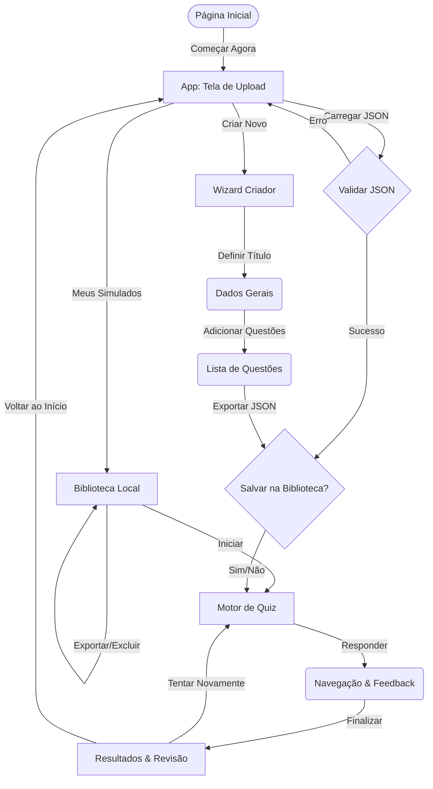

# ⚡ QuizLab | Tech-Industrial Edition

**QuizLab** é uma plataforma de simulados educacionais de alta performance com estética **Cyber Green** e design focado em eficiência. Construído com arquitetura **Client-Side** (100% no navegador), o projeto prioriza o aproveitamento total de tela e a privacidade do usuário, garantindo uma experiência rápida e segura.

[](https://quizlab-chi.vercel.app/)

---

## 📋 Índice

1. [Visão Geral e Fluxo](#-visão-geral-e-fluxo)
2. [Funcionalidades Principais](#-funcionalidades-principais)
3. [Arquitetura Técnica](#-arquitetura-técnica)
4. [Biblioteca Local (Cache)](#-biblioteca-local-cache)
5. [Especificação de Dados (JSON)](#-especificação-de-dados-json)
6. [Identidade Visual](#-identidade-visual-cyber-green)
7. [Licença](#-licença-e-créditos)

---

## 🔭 Visão Geral e Fluxo

O QuizLab foi desenhado para ser uma ferramenta ágil e intuitiva. O diagrama abaixo ilustra o fluxo de navegação do usuário.



---

## 🚀 Funcionalidades Principais

- **📚 Biblioteca Local Avançada**: Armazene até 10 simulados com sistema de **Busca por Tags**, ordenação e estatísticas de uso detalhadas.
- **📊 Estatísticas de Desempenho**: Acompanhe o número de vezes jogado, data da última vez e média de acertos por simulado.
- **🎨 Interface Otimizada**: Design industrial focado em eficiência, agora com **Skeleton Screens** para carregamento fluido.
- **🛠️ Criador Assistido**: Sistema de etapas (Wizard) com reordenação via **Drag & Drop**, preview do JSON e salvamento de rascunhos.
- **📑 Documentação Interativa**: Central de ajuda reformulada com busca interna, guia de troubleshooting e arquivo de exemplo para download.
- **🔒 Privacidade Absoluta**: Processamento 100% local. Seus dados e simulados nunca saem do seu dispositivo.
- **📱 UX Dinâmica & Acessível**: Navegação livre no quiz, grid de progresso clicável, e suporte completo a **Atalhos de Teclado (A11Y)**.

---

## 💻 Arquitetura Técnica

O sistema opera de forma reativa e puramente local, utilizando o navegador como motor de processamento.

- **Vanilla CSS**: Sistema de Design Tokens, Glassmorphism, animações de Skeleton e Layouts Grid/Flexbox.
- **Vanilla JavaScript**: Lógica pura e modularizada, validação robusta de JSON com diagnóstico de erros.
- **LocalStorage API**: Gerenciamento persistente da biblioteca e sistema de rascunhos (Auto-save).
- **SVG System**: Ícones vetoriais e animações CSS para feedback visual imediato (Toasts/Loaders).

---

## 📚 Biblioteca Local (Cache)

O sistema de cache foi projetado para equilibrar conveniência e performance:

1.  **Limite Rígido:** Máximo de **10 simulados** salvos.
2.  **Organização:** Filtros por Título, Descrição ou **Tags** (novo campo opcional).
3.  **Estatísticas:** A cada conclusão de simulado, o sistema atualiza automaticamente a média de acertos e o contador de jogadas.
4.  **Busca em Tempo Real:** Encontre rapidamente seus testes com o filtro dinâmico integrado.

---

## 📝 Especificação de Dados (JSON)

O formato JSON do QuizLab suporta campos avançados para organização:

```json
{
  "nomeSimulado": "...",
  "descricao": "...",
  "tags": ["matemática", "ENEM"],
  "questoes": [
    {
      "id": 1,
      "enunciado": "...",
      "tipo": "unica",
      "alternativas": [...],
      "respostasCorretas": [...]
    }
  ]
}
```

### Novas Funcionalidades de Navegação
- **Navegação Livre:** O sistema agora permite pular questões e navegar diretamente via grid de progresso.
- **Modo Revisão:** Antes de finalizar, você revisa o status de todas as questões para garantir que nada ficou em branco.