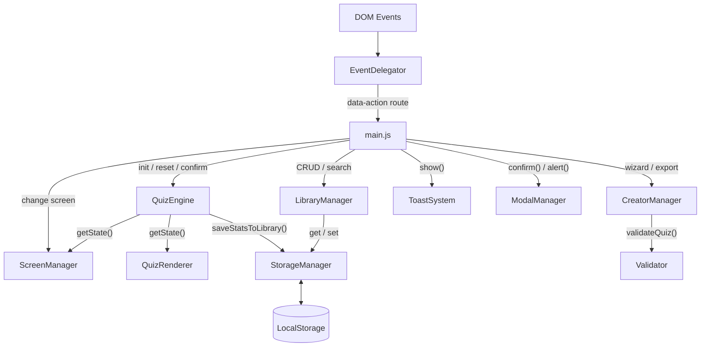
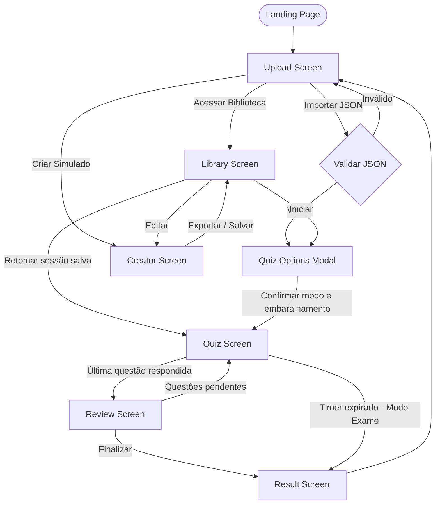

# QuizLab


> **Autor:** José Anderson ([@DessimA](https://github.com/DessimA))  
> **LinkedIn:** [/in/dessim](https://www.linkedin.com/in/dessim/)  
> **Website:** [meus-links-olive.vercel.app](https://meus-links-olive.vercel.app/)

---

## Índice

1. [Visão Geral](#visão-geral)
2. [Arquitetura de Software](#arquitetura-de-software)
3. [Estrutura de Pastas](#estrutura-de-pastas)
4. [Módulos e Responsabilidades](#módulos-e-responsabilidades)
5. [Telas e Fluxo de Navegação](#telas-e-fluxo-de-navegação)
6. [Regras de Negócio](#regras-de-negócio)
7. [Requisitos Funcionais](#requisitos-funcionais)
8. [Requisitos Não Funcionais](#requisitos-não-funcionais)
9. [Protocolo JSON](#protocolo-json)
10. [Persistência de Dados](#persistência-de-dados)
11. [Design System](#design-system)
12. [Testes Automatizados](#testes-automatizados)
13. [CI/CD](#cicd)
14. [Contribuição](#contribuição)

---

## Visão Geral

O **QuizLab** é uma *Single Page Application* (SPA) desenvolvida inteiramente em **Vanilla JavaScript (ES6+)**, sem nenhuma dependência externa. A aplicação permite criar, importar, gerenciar e responder simulados de múltipla escolha diretamente no navegador.

Toda a lógica de negócio, validação, estado e persistência ocorre no lado do cliente (*client-side*), sem necessidade de servidor ou backend. A aplicação funciona offline após o primeiro carregamento graças a um **Service Worker** (PWA).

**Pilares do projeto:**

- **Zero Dependencies** nenhuma biblioteca externa, npm, bundler ou framework.
- **Client-Side First** lógica e persistência vivem inteiramente no navegador.
- **Modularidade** cada responsabilidade é isolada em um módulo IIFE próprio.
- **DRY** lógica de renderização e validação reutilizável em toda a base de código.

---

## Arquitetura de Software

O projeto não utiliza classes de POO clássica. Todos os módulos são **objetos Singleton** encapsulados em **IIFEs** (*Immediately Invoked Function Expressions*) e expostos no escopo global via `window`, simulando *namespaces*.

O padrão de comunicação central é o **Event Delegation**: um único listener no `document` intercepta todos os eventos, roteia pelo atributo `data-action` do elemento HTML e executa o handler registrado no `main.js`. Isso elimina `addEventListener` espalhados pelo código e desacopla completamente o HTML da lógica JS.


### Separação de Camadas

| Camada | Responsabilidade |
|:---|:---|
| **Core** | Configurações globais, persistência, validação |
| **Components** | Componentes de UI reutilizáveis sem estado de negócio |
| **Features** | Lógica de negócio de cada funcionalidade |
| **UI** | Renderização de telas e roteamento de eventos |

---

## Estrutura de Pastas
```
quizlab/
├── index.html
├── docs.html
├── troubleshooting.html
├── styles.css
├── sw.js                          # Service Worker (PWA)
├── manifest.json
├── package.json
│
├── js/
│   ├── main.js                    # Entry point e registro global de eventos
│   ├── core/
│   │   ├── version.js             # Constante APP_VERSION (fonte única de verdade)
│   │   ├── config.js              # CONFIG e Utils (constantes, enums, helpers puros)
│   │   ├── storage-manager.js     # Facade para o localStorage
│   │   └── validator.js           # Validação de schema JSON e inputs do criador
│   ├── components/
│   │   ├── icon-system.js         # Injeção de SVG inline
│   │   ├── theme-manager.js       # Toggle dark/light com persistência
│   │   ├── modal-manager.js       # Modais de confirmação, alerta e custom
│   │   ├── toast-system.js        # Notificações flutuantes não-bloqueantes
│   │   └── focus-trap.js          # Acessibilidade: foco dentro de modais
│   ├── features/
│   │   ├── quiz-engine.js         # Estado do quiz, lógica de resposta e timer
│   │   ├── creator-manager.js     # Wizard de criação e drag & drop
│   │   ├── library-manager.js     # Renderização e busca da biblioteca
│   │   ├── review-manager.js      # Tela de revisão e resultado final
│   │   └── file-handler.js        # Leitura, parse e deduplicação de JSON importado
│   └── ui/
│       ├── screen-manager.js      # Troca de telas e sincronização do timer bar
│       ├── quiz-renderer.js       # Renderização das questões no DOM
│       └── event-delegator.js     # Listener único e roteamento por data-action
│
├── tests/
│   ├── setup/
│   │   ├── environment.js         # Polyfills de DOM para Node.js
│   │   └── loader.js              # Carregador de módulos IIFE em Node
│   ├── unit/
│   │   ├── quiz-engine.test.js
│   │   ├── validator.test.js
│   │   └── storage-manager.test.js
│   └── integration/
│       └── quiz-flow.test.js
│
└── .github/
    └── workflows/
        ├── ci.yml                 # Testes em PRs para main e develop
        └── deploy.yml             # Testes em push para main (produção)
```

---

## Módulos e Responsabilidades

### `version.js`
Define a constante `APP_VERSION` como fonte única de verdade da versão da aplicação. É carregado primeiro pelo `index.html` e pelo `sw.js`, garantindo que o nome do cache do Service Worker seja sempre atualizado junto com a versão.

### `config.js`
Centraliza todas as constantes, enums e funções utilitárias puras da aplicação.
```javascript
CONFIG.STORAGE        // chaves do localStorage
CONFIG.LIMITS         // slots, tamanhos, histórico
CONFIG.TIMINGS        // autosave (30s), toast (4s), delay (500ms), timer (120s/questão)
CONFIG.QUESTION_TYPES // 'unica' | 'multipla'
CONFIG.QUIZ_MODES     // 'study' | 'exam'
CONFIG.ELEMENTS       // IDs das telas no DOM

Utils.formatTime(seconds)   // formata MM:SS
Utils.truncate(text)        // corta com reticências
```

### `storage-manager.js`
*Facade* para o `localStorage`. Todas as operações de leitura e escrita passam por aqui, centralizando a serialização JSON e o tratamento de erros. Também é o único ponto responsável por garantir consistência entre os dados da biblioteca e da sessão ativa (ex.: ao excluir um quiz, a sessão órfã é limpa antes).

### `validator.js`
Valida estruturas de dados em dois contextos:

- `validateQuiz(data)` valida um objeto JSON completo antes de importar ou exportar. Retorna `{ valid: Boolean, errors: String[] }`.
- `isQuestionCardValid(card)` valida um card de questão no DOM do criador em tempo real.

### `quiz-engine.js`
O "cérebro" da aplicação. Não toca no DOM. Mantém e expõe o estado completo do quiz em andamento.

**Estado (`_state`):**
```javascript
{
    quizData: Object,           // JSON carregado (com questões possivelmente embaralhadas)
    libraryId: String|null,     // ID na biblioteca, se salvo
    mode: 'study' | 'exam',
    currentQuestion: Number,    // índice atual (base 0)
    userAnswers: Array,         // String | String[] | null por questão
    questionAnswered: Array,    // Boolean[] true após confirmar
    visitedQuestions: Array,    // Boolean[] true ao navegar para a questão
    correctCount: Number,
    incorrectCount: Number,
    flagged: Number[],          // índices das questões marcadas
    timerSeconds: Number,       // tempo total do exame em segundos
    timerRemaining: Number      // tempo restante
}
```

**Status por questão** (`getQuestionStatus(index)`):

| Status | Condição |
|:---|:---|
| `pending` | nunca visitada |
| `skipped` | visitada, não respondida |
| `correct` | respondida corretamente |
| `incorrect` | respondida incorretamente |

**Timer (Modo Exame):** calculado como `questões × 120 segundos`. Dispara o evento `quizlab:timer-tick` a cada segundo e `quizlab:timer-expired` ao zerar, encerrando o quiz automaticamente.

**Sessão:** o estado completo é serializado no `localStorage` após cada ação do usuário, mas **somente no Modo Estudo**. No Modo Exame não há persistência de sessão.

### `creator-manager.js`
Gerencia o Wizard de criação em dois estágios:

1. **Meta** título (obrigatório), descrição, tags e tempo limite opcional.
2. **Questões** adição, remoção, reordenação via *drag & drop* nativo e validação em tempo real de cada card.

Suporta edição de simulados existentes da biblioteca (`loadForEdit`). Ao exportar, oferece opção de salvar na biblioteca ou apenas baixar o arquivo JSON. Salva rascunho automaticamente a cada 30 segundos via `autosave`.

### `library-manager.js`
Renderiza a grade de simulados salvos com suporte a busca textual (nome, descrição, tags) e ordenação (recente, mais antigo, A-Z, quantidade de questões). Exibe métricas por card: média de acertos, número de vezes jogado, último acesso e histórico visual de desempenho (barras das últimas 6 partidas).

Se houver uma sessão de estudo salva para um simulado, o card exibe o botão **Retomar** ao lado do botão **Iniciar**.

### `file-handler.js`
Lê arquivos `.json` via `FileReader`, faz o parse e valida com `Validator.validateQuiz`. Se válido, verifica duplicatas por nome e hash de conteúdo antes de salvar na biblioteca. Trata três cenários: novo simulado, simulado com mesmo nome e mesmo conteúdo (reaproveita o ID existente) e simulado com mesmo nome mas conteúdo diferente (oferece substituição).

### `screen-manager.js`
Controla a visibilidade das telas via classes CSS. Expõe métodos de alto nível como `loadQuiz(data, id, options)` e `resumeSession(session)` que encapsulam a sequência de inicializar o engine, trocar de tela e sincronizar o timer bar do modo exame.

### `event-delegator.js`
Registra três listeners no `document` (`click`, `input`, `change`) e um listener para *drag & drop* do criador. Ao capturar um evento, sobe a árvore DOM buscando o atributo `data-action`, `data-oninput` ou `data-onchange` e executa o handler correspondente registrado via `register()` ou `registerMultiple()`.

### `quiz-renderer.js`
Constrói o HTML da questão atual a partir do estado do `QuizEngine` e injeta no DOM. Renderiza alternativas com estado visual correto (selecionada, correta, incorreta, travada), barra de progresso, grid de navegação, badges de status e o botão de finalizar (somente na última questão respondida).

---

## Telas e Fluxo de Navegação


**Telas registradas em `CONFIG.ELEMENTS`:**

| ID | Descrição |
|:---|:---|
| `landingPage` | Apresentação inicial com CTAs |
| `uploadScreen` | Hub principal: importar, biblioteca, criar |
| `quizScreen` | Resolução das questões |
| `reviewScreen` | Revisão de questões pendentes antes de finalizar |
| `resultScreen` | Resultado final com estatísticas |
| `libraryScreen` | Grade de simulados salvos |
| `creatorScreen` | Wizard de criação e edição |

---

## Regras de Negócio

### Importação de JSON
- Somente arquivos `.json` são aceitos.
- O arquivo passa pela validação completa de schema antes de qualquer outra ação.
- Se o simulado já existe na biblioteca com o mesmo nome e mesmo conteúdo (verificado via hash dos IDs das questões), o arquivo importado reutiliza o ID existente sem duplicar.
- Se o nome coincide mas o conteúdo difere, o usuário é consultado para substituir ou não.
- Se a biblioteca estiver cheia (10 slots), a importação é bloqueada com mensagem de erro.

### Biblioteca
- Capacidade máxima de **10 simulados**.
- Cada item armazena metadados de desempenho: média de acertos, número de partidas, data do último acesso e histórico das últimas **10 partidas**.
- A média de acertos é recalculada a partir do histórico completo a cada partida finalizada.
- Ao excluir um simulado, a sessão ativa associada a ele é removida automaticamente do `localStorage` antes da exclusão do item.

### Modo de Jogo
Ao iniciar um simulado, o usuário escolhe:

- **Modo Estudo** feedback visual imediato após confirmar cada resposta (alternativa correta/incorreta destacada). O progresso é salvo automaticamente no `localStorage` após cada ação.
- **Modo Exame** sem feedback durante o quiz. O resultado só é exibido ao final. O timer é obrigatório e não pode ser desabilitado. O progresso **não é salvo** no modo exame.

O usuário também pode optar por embaralhar a ordem das questões e/ou a ordem das alternativas de cada questão de forma independente.

### Timer (Modo Exame)
- Tempo calculado: `número de questões × 120 segundos`.
- Uma barra de timer dedicada (`#examTimerBar`) exibe o tempo restante, posicionada fora do painel colapsável para nunca ser ocultada.
- Quando restam **60 segundos ou menos**, o timer entra em estado de alerta visual com animação de pulso e cor de erro.
- Ao zerar, o evento `quizlab:timer-expired` é disparado, o quiz é encerrado automaticamente e o resultado é exibido.

### Seleção e Confirmação de Respostas
- **Questão de única escolha (`unica`):** somente uma alternativa pode estar selecionada por vez. Selecionar outra substitui a anterior.
- **Questão de múltipla escolha (`multipla`):** o usuário pode selecionar até o número exato de respostas corretas definido no JSON. Ao atingir o limite, novas seleções são ignoradas. Selecionar uma alternativa já marcada a desmarca (toggle).
- O botão **Confirmar** fica desabilitado até que ao menos uma alternativa esteja selecionada.
- Após confirmar, a questão fica **travada**: nenhuma alternativa pode ser alterada.

### Marcação de Questões (Flag)
- O usuário pode marcar qualquer questão com uma flag durante o quiz.
- A flag funciona como toggle: marcar duas vezes desmarca.
- Questões marcadas aparecem com indicação visual na grade de navegação.
- As flags são incluídas nas estatísticas finais e na sessão salva.

### Finalização e Revisão
- O botão **Finalizar** só é renderizado no DOM quando o usuário está na **última questão** e ela foi **respondida e confirmada**.
- Ao clicar em Finalizar, o sistema exibe a **Tela de Revisão**, listando todas as questões não confirmadas com badge "PENDENTE". O usuário pode navegar de volta a qualquer questão pendente antes de concluir definitivamente.
- Ao confirmar a finalização, as estatísticas são salvas na biblioteca (se o simulado estiver salvo) e a sessão é limpa.

### Criador de Simulados
- O título do simulado é **obrigatório** para avançar do estágio Meta para o estágio Questões.
- O enunciado de cada questão deve ter no mínimo **5 caracteres** e no máximo **500**.
- Cada questão deve ter no mínimo **2 alternativas**.
- Para questão de única escolha, exatamente **1 alternativa** deve ser marcada como correta.
- Para questão de múltipla escolha, ao menos **2 alternativas** devem ser marcadas como corretas.
- O botão de exportar fica desabilitado enquanto qualquer questão estiver inválida.
- O rascunho é salvo automaticamente a cada **30 segundos** no `localStorage`.
- A ordem das questões pode ser reordenada via **drag & drop** nativo. Ao soltar, os números são renumerados automaticamente.

### Sessão de Progresso
- A sessão é salva somente no **Modo Estudo**, a cada ação do usuário (seleção, confirmação, navegação, flag).
- Na tela da biblioteca, o card do simulado com sessão ativa exibe o botão **Retomar**.
- Ao clicar em **Iniciar** (não Retomar) em um simulado com sessão ativa, o usuário é perguntado se deseja retomar ou iniciar uma nova tentativa.
- Iniciar nova tentativa limpa a sessão antes de abrir o modal de opções.

---

## Requisitos Funcionais

**RF01 Importar simulado via JSON**
O sistema deve aceitar arquivos `.json`, validar sua estrutura e adicioná-los à biblioteca automaticamente.

**RF02 Criar simulado via interface**
O sistema deve oferecer um Wizard em dois estágios (meta e questões) para criação de simulados sem necessidade de editar JSON manualmente.

**RF03 Editar simulado existente**
O sistema deve permitir carregar qualquer simulado da biblioteca no criador para edição, preservando o ID original ao salvar.

**RF04 Exportar simulado como arquivo JSON**
O sistema deve permitir baixar qualquer simulado da biblioteca como arquivo `.json` compatível com o protocolo de importação.

**RF05 Biblioteca de simulados**
O sistema deve armazenar, listar, buscar, ordenar e excluir simulados salvos. Deve exibir métricas de desempenho por simulado.

**RF06 Modo Estudo**
O sistema deve exibir feedback visual imediato (correto/incorreto) após a confirmação de cada resposta e salvar o progresso automaticamente.

**RF07 Modo Exame**
O sistema deve executar o quiz sem feedback, com timer decrescente, e exibir o resultado somente ao final ou quando o tempo esgotar.

**RF08 Questões de única e múltipla escolha**
O sistema deve suportar questões com exatamente uma resposta correta e questões com múltiplas respostas corretas, com comportamento de seleção adequado a cada tipo.

**RF09 Embaralhamento**
O sistema deve permitir embaralhar a ordem das questões e/ou a ordem das alternativas de forma independente antes de iniciar o quiz.

**RF10 Marcação de questões (flag)**
O sistema deve permitir marcar e desmarcar questões durante o quiz para referência futura.

**RF11 Navegação livre entre questões**
O sistema deve permitir navegar para qualquer questão visitada anteriormente via grade de progresso.

**RF12 Revisão antes de finalizar**
O sistema deve exibir uma tela de revisão listando questões não confirmadas antes de permitir a finalização definitiva.

**RF13 Retomar sessão salva**
O sistema deve detectar e oferecer a retomada de progresso salvo de sessões anteriores no Modo Estudo.

**RF14 Tema claro e escuro**
O sistema deve oferecer alternância entre tema escuro (padrão) e claro, com persistência da preferência.

**RF15 Onboarding de primeira visita**
O sistema deve exibir um modal de boas-vindas na primeira vez que o usuário acessa a aplicação.

**RF16 Rascunho automático**
O sistema deve salvar automaticamente o estado do criador a cada 30 segundos enquanto o usuário edita.

---

## Requisitos Não Funcionais

**RNF01 Zero Dependências**
A aplicação não deve depender de nenhuma biblioteca, framework ou pacote npm externo. Todo o código é Vanilla JavaScript (ES6+).

**RNF02 Funciona Offline (PWA)**
Após o primeiro carregamento, a aplicação deve funcionar sem conexão com a internet. O Service Worker usa estratégia *Cache First* para fontes e *Network First* para HTML, CSS e JS. O nome do cache é versionado por `APP_VERSION`.

**RNF03 Persistência Client-Side**
Todos os dados (biblioteca, sessão, rascunho, preferências) são armazenados no `localStorage` do navegador. Não há comunicação com servidor.

**RNF04 Responsividade**
A interface deve funcionar corretamente em telas mobile (< 480px), tablet (768px–1023px) e desktop (≥ 1024px), com layouts adaptados para cada breakpoint.

**RNF05 Performance de Eventos**
Todos os eventos de clique, input e change devem ser capturados por um único listener por tipo no `document` (Event Delegation), evitando múltiplos listeners em elementos dinâmicos.

**RNF06 Integridade de Estado**
O `QuizEngine` não deve manipular o DOM diretamente. O `StorageManager` deve ser o único ponto de acesso ao `localStorage`. Cada módulo deve ter responsabilidade única e bem definida (SRP).

**RNF07 Acessibilidade**
Modais devem implementar *focus trap* para manter a navegação por teclado dentro do modal enquanto aberto. Botões de toggle de tema devem ter `aria-label` atualizado dinamicamente.

**RNF08 Limite de Armazenamento**
A biblioteca é limitada a 10 simulados e o histórico de partidas a 10 entradas por simulado, prevenindo crescimento ilimitado do `localStorage`.

**RNF09 Tempo Mínimo de Loading**
Operações de leitura de arquivo devem exibir um overlay de carregamento por no mínimo 500ms, evitando flash de conteúdo em arquivos pequenos.

**RNF10 Testes Automatizados**
Toda lógica de negócio dos módulos `QuizEngine`, `Validator` e `StorageManager` deve ser coberta por testes unitários. Fluxos completos de quiz devem ser cobertos por testes de integração. Os testes usam o runner nativo do Node.js (sem dependências externas).

**RNF11 Versionamento do Código**
A versão da aplicação deve ser definida em um único arquivo (`version.js`) e referenciada pelos demais pontos que precisam dela (`sw.js`, badges).

---

## Protocolo JSON

O sistema valida estritamente qualquer arquivo importado. Campos marcados como obrigatórios causam falha de validação com mensagem descritiva.
```json
{
  "nomeSimulado": "String obrigatório",
  "descricao": "String opcional",
  "tags": ["array", "de", "strings", "opcional"],
  "tempoLimiteMinutos": 30,
  "questoes": [
    {
      "id": "qualquer valor usado internamente como hash",
      "enunciado": "String obrigatório, mínimo 5 chars",
      "tipo": "unica | multipla",
      "alternativas": [
        { "id": "a", "texto": "Texto da alternativa" },
        { "id": "b", "texto": "Texto da alternativa" }
      ],
      "respostasCorretas": ["a"]
    }
  ]
}
```

**Regras de validação do schema:**

- `nomeSimulado` deve ser uma string não vazia.
- `questoes` deve ser um array com ao menos 1 item.
- Cada questão deve ter `enunciado` não vazio, `tipo` igual a `'unica'` ou `'multipla'`, e ao menos 2 alternativas.
- `respostasCorretas` deve ser um array não vazio, e cada ID referenciado deve existir em `alternativas`.

---

## Persistência de Dados

| Chave | Tipo | Descrição |
|:---|:---|:---|
| `quizlab_library` | `Array<Object>` | Simulados salvos com dados e metadados |
| `quizlab_session` | `Object` | Progresso de sessão em andamento (apenas Modo Estudo) |
| `quizlab_draft` | `Object` | Rascunho do criador (autosave) |
| `quizlab_first_visit` | `'true'` | Flag de controle do onboarding |
| `quizlab_theme` | `'dark' \| 'light'` | Preferência de tema |

**Estrutura de um item na biblioteca:**
```javascript
{
    id: "quiz_1700000000000",
    data: { /* JSON completo do simulado */ },
    meta: {
        addedAt: Number,          // timestamp de adição
        questionsCount: Number,   // cache do total de questões
        timesPlayed: Number,
        lastPlayed: Number,       // timestamp
        averageScore: Number,     // 0-100, recalculado a cada partida
        history: [                // últimas 10 partidas
            {
                playedAt: Number,
                score: Number,    // percentual de acertos
                correct: Number,
                total: Number
            }
        ]
    }
}
```

---

## Design System

A aplicação usa variáveis CSS no `:root` para todas as cores, espaçamentos, tipografia e sombras. O visual segue a estética **Glassmorphism** com fundo escuro translúcido, bordas sutis e cor primária neon.

### Cores semânticas

| Variável | Valor (dark) | Uso |
|:---|:---|:---|
| `--primary-500` | `#c4ff00` | Ações primárias, foco, seleção, neon |
| `--success` | `#00ff9d` | Resposta correta, badge "Respondida" |
| `--error` | `#ff0055` | Resposta incorreta, timer em alerta |
| `--bg-glass` | `rgba(15,15,15,0.92)` | Fundo de cards e modais |
| `--border-glass` | `rgba(255,255,255,0.08)` | Bordas dos componentes |

O tema claro sobrescreve as variáveis via seletor `[data-theme="light"]`, sem duplicar nenhuma regra de layout.

### Componentes de UI

- **IconSystem** injeta SVGs inline via `data-icon` attribute, evitando requisições externas de imagem. Usa `document.fonts.load()` para aguardar o carregamento da fonte de ícones antes de renderizar.
- **ToastSystem** notificações flutuantes com auto-dismiss (4s), tipos `info`, `success` e `error`.
- **ModalManager** gerencia sobreposições de confirmação (`confirm`), alerta (`alert`) e custom. Suporta múltiplos modais identificados por ID.
- **FocusTrap** ao abrir um modal, prende o foco dentro dele para compatibilidade com navegação por teclado.
- **ThemeManager** alterna `data-theme` no `<html>`, persiste no `localStorage` e atualiza o ícone e `aria-label` do botão de toggle dinamicamente.

---

## Testes Automatizados

O projeto usa o **runner nativo do Node.js** (`node:test`) sem nenhuma dependência externa.
```bash
npm test              # todos os testes
npm run test:unit     # apenas unitários
npm run test:integration  # apenas integração
```

**Cobertura:**

- `quiz-engine.test.js` — init, select (única/múltipla), confirm, navigate, flag, reset, getQuestionStatus, shuffling.
- `validator.test.js` — casos válidos, campos obrigatórios ausentes, tipos inválidos, alternativas, respostas corretas.
- `storage-manager.test.js` — CRUD da biblioteca, replaceInLibrary, updateLibraryMeta, removeManyFromLibrary, session, draft, histórico com limite, getStorageStats fallback, canStore com threshold simulado.
- `file-handler.test.js` — _findDuplicate, _handleSingle (válido/inválido), _handleBatch (salvos, skipped, conflito, armazenamento cheio, redirect para biblioteca), handleMultiple (filtro de extensão).
- `quiz-flow.test.js` — fluxo completo: adicionar à biblioteca → iniciar → responder → salvar stats → acumulação de média.

Os testes rodam em Node.js >= 21 sem DOM real. O ambiente é simulado via polyfills em `tests/setup/environment.js` e os módulos IIFE são carregados via `tests/setup/loader.js`.

---

## CI/CD

**`ci.yml`** Executa em Pull Requests para `main` e `develop` e em pushes para `develop`:
1. Checkout do código
2. Setup Node.js 22
3. `npm run test:unit`
4. `npm run test:integration`

**`deploy.yml`** Executa em push para `main` (produção):
1. Checkout do código
2. Setup Node.js 22
3. `npm test` (suite completa)

---

## Contribuição

Leia o **[CONTRIBUTING.md](CONTRIBUTING.md)** para entender os padrões de arquitetura (IIFE, Event Delegation), convenções de commit (Conventional Commits) e o checklist de qualidade antes de enviar um Pull Request.

---

*Documentação gerada com base na versão v1.2.0.*