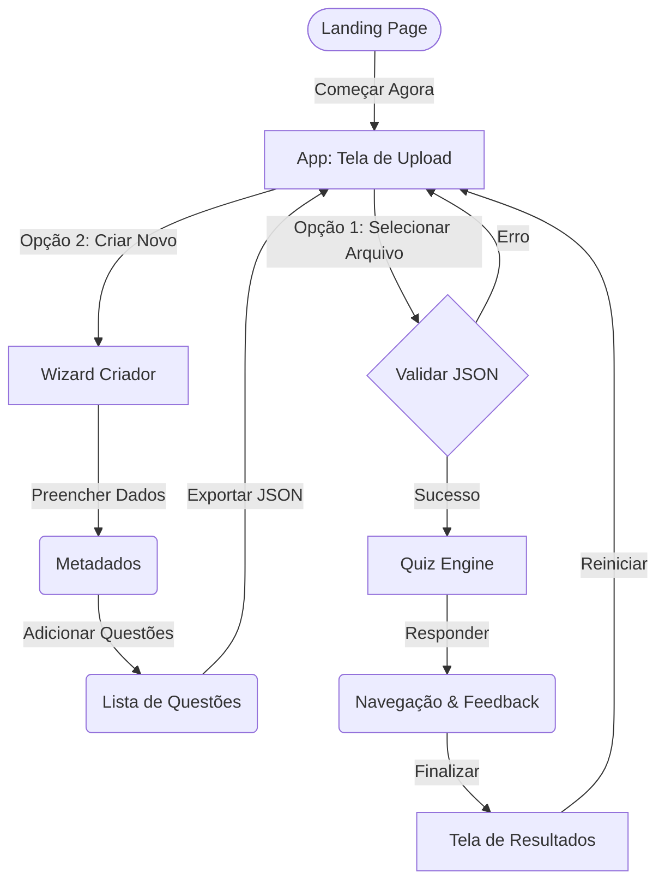
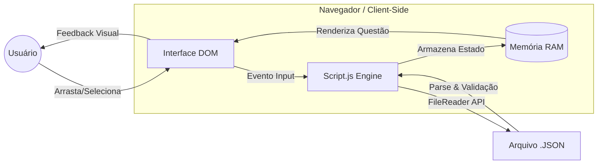
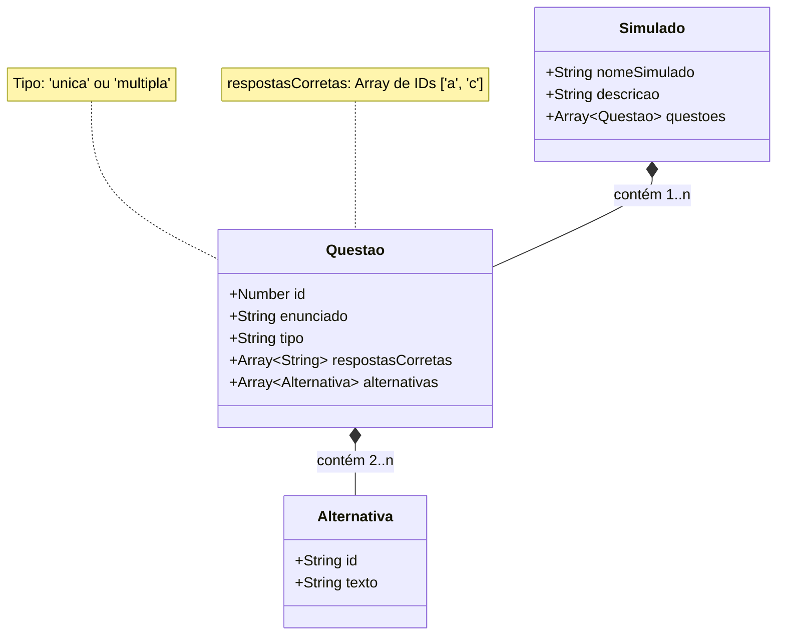

# ⚡ QuizLab | Tech-Industrial Edition

**QuizLab** é uma plataforma de simulados educacionais de alta performance com estética **Cyber Green** e design focado em eficiência. Com uma arquitetura **Tech-Industrial** (formas retangulares e densidade de informação), o projeto prioriza o aproveitamento de tela e a privacidade do usuário, funcionando inteiramente no navegador (client-side).

[](https://quizlab-chi.vercel.app/)
*(Acesse o projeto online)*

---

## 📋 Índice

1. [Visão Geral e Fluxo](#-visão-geral-e-fluxo)
2. [Funcionalidades Principais](#-funcionalidades-principais)
3. [Arquitetura Técnica](#-arquitetura-técnica)
4. [Especificação de Dados (JSON)](#-especificação-de-dados-json)
5. [Identidade Visual](#-identidade-visual-cyber-green)
6. [Instalação e Licença](#-instalação-e-licença)

---

## 🔭 Visão Geral e Fluxo

O QuizLab foi desenhado para ser uma ferramenta ágil. O diagrama abaixo ilustra o fluxo de navegação do usuário.



---

## 🚀 Funcionalidades Principais

- **🎨 Design Industrial**: Interface retangular compacta, otimizada para produtividade e foco.
- **🛠️ Criador Wizard**: Assistente passo-a-passo com sistema de Accordion para criar simulados.
- **📑 Documentação Integrada**: Central de ajuda dedicada acessível via `docs.html`.
- **🔘 Icon-First**: Navegação intuitiva baseada em ícones.
- **🔒 Privacidade Absoluta**: Sem servidores. Seus dados nunca saem do navegador.
- **📱 UX Dinâmica**: Navbar inteligente (auto-hide) e suporte a **Double Tap** no mobile.

---

## 💻 Arquitetura Técnica

Construído sob o princípio **DRY**, o sistema processa tudo localmente. O diagrama abaixo demonstra o fluxo de dados na memória.



- **Vanilla CSS**: Sistema de Design Tokens, Glassmorphism e Grid.
- **Vanilla JavaScript**: Lógica reativa sem dependências externas.
- **SVG System**: Ícones vetoriais integrados para performance máxima.

---

## 📂 Estrutura do Projeto

```bash
quizlab/
├── index.html      # Núcleo da aplicação (Landing Page + App + Creator)
├── docs.html       # Central de Documentação técnica e de usuário
├── styles.css      # Sistema de design (Tokens, Componentes e Animações)
├── script.js       # Engine do Quiz, Criador Visual e Navegação
└── assets/         # Favicon e recursos visuais
```

---

## 📝 Especificação de Dados (JSON)

O QuizLab utiliza um formato JSON estrito. Abaixo, a representação da estrutura de dados:



Para mais detalhes e exemplos de código, consulte a **[Documentação Online](docs.html)**.

---

## 🎨 Identidade Visual (Cyber Green)

| Token | Valor | Aplicação |
|-------|-------|-----------|
| `--primary-500` | `#c4ff00` | Ações principais e Neons |
| `--bg-body` | `#050505` | Base do sistema |
| `--radius-sm` | `2px` | Cantos técnicos e precisos |
| `--success` | `#00ff9d` | Feedback positivo |
| `--error` | `#ff0055` | Alertas e erros |

---

## 🔧 Instalação e Uso

Não é necessário instalar dependências.

1. **Clone o repositório**:
   ```bash
   git clone https://github.com/DessimA/quizlab.git
   ```
2. **Execute**:
   Abra o arquivo `index.html` em qualquer navegador moderno.

---

## 📄 Licença e Créditos

Projeto desenvolvido com excelência técnica por **José Anderson da Silva Costa**. Disponível para uso sob a licença MIT.

<p align="center">
  <a href="https://www.linkedin.com/in/dessim/" target="_blank"></a>
  <a href="https://github.com/DessimA" target="_blank"></a>
  <a href="https://meus-links-olive.vercel.app/" target="_blank"></a>
</p>