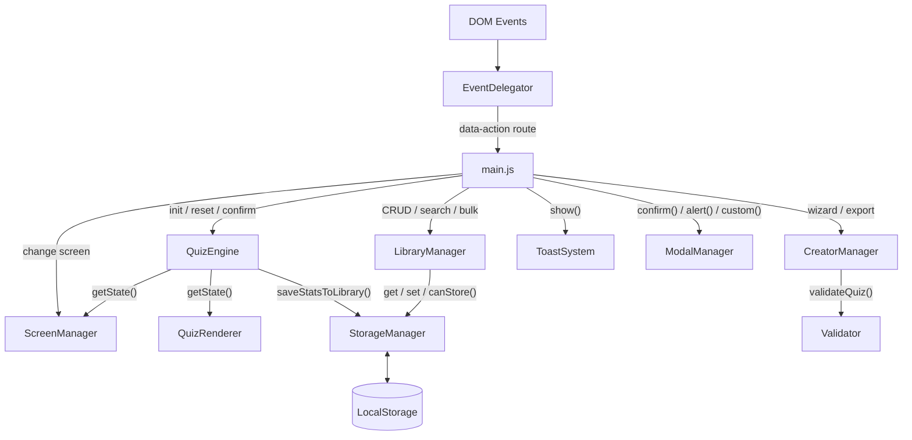
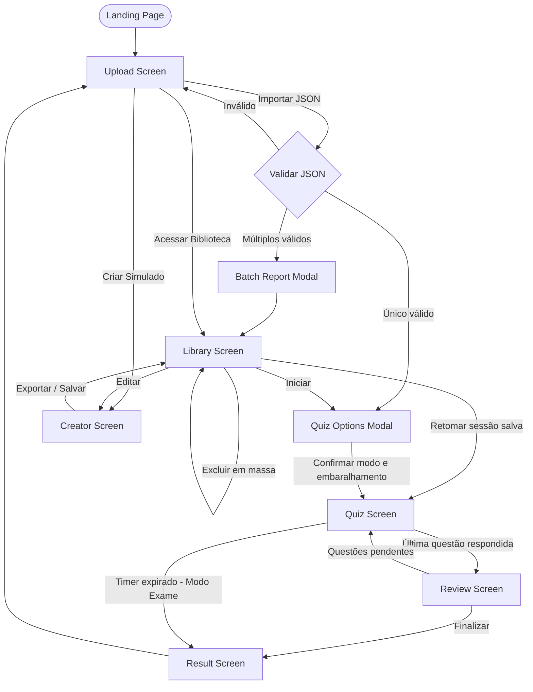

# QuizLab


> **Autor:** José Anderson ([@DessimA](https://github.com/DessimA))  
> **LinkedIn:** [/in/dessim](https://www.linkedin.com/in/dessim/)  
> **Website:** [jasc-dessima-dev.vercel.app](https://jasc-dessima-dev.vercel.app/)

---

## Índice

1. [Visão Geral](#visão-geral)
2. [Arquitetura de Software](#arquitetura-de-software)
3. [Estrutura de Pastas](#estrutura-de-pastas)
4. [Módulos e Responsabilidades](#módulos-e-responsabilidades)
5. [Telas e Fluxo de Navegação](#telas-e-fluxo-de-navegação)
6. [Regras de Negócio](#regras-de-negócio)
7. [Requisitos Funcionais](#requisitos-funcionais)
8. [Requisitos Não Funcionais](#requisitos-não-funcionais)
9. [Protocolo JSON](#protocolo-json)
10. [Persistência de Dados](#persistência-de-dados)
11. [Design System](#design-system)
12. [Testes Automatizados](#testes-automatizados)
13. [CI/CD](#cicd)
14. [Contribuição](#contribuição)

---

## Visão Geral

O **QuizLab** é uma *Single Page Application* (SPA) desenvolvida inteiramente em **Vanilla JavaScript (ES6+)**, sem nenhuma dependência externa. A aplicação permite criar, importar, gerenciar e responder simulados de múltipla escolha diretamente no navegador.

Toda a lógica de negócio, validação, estado e persistência ocorre no lado do cliente (*client-side*), sem necessidade de servidor ou backend. A aplicação funciona offline após o primeiro carregamento graças a um **Service Worker** (PWA).

**Pilares do projeto:**

- **Zero Dependencies** nenhuma biblioteca externa, npm, bundler ou framework.
- **Client-Side First** lógica e persistência vivem inteiramente no navegador.
- **Modularidade** cada responsabilidade é isolada em um módulo IIFE próprio.
- **DRY** lógica de renderização e validação reutilizável em toda a base de código.

---

## Arquitetura de Software

O projeto não utiliza classes de POO clássica. Todos os módulos são **objetos Singleton** encapsulados em **IIFEs** (*Immediately Invoked Function Expressions*) e expostos no escopo global via `window`, simulando *namespaces*.

O padrão de comunicação central é o **Event Delegation**: um único listener no `document` intercepta todos os eventos, roteia pelo atributo `data-action` do elemento HTML e executa o handler registrado no `main.js`. Isso elimina `addEventListener` espalhados pelo código e desacopla completamente o HTML da lógica JS.


### Separação de Camadas

| Camada | Responsabilidade |
|:---|:---|
| **Core** | Configurações globais, persistência, validação |
| **Components** | Componentes de UI reutilizáveis sem estado de negócio |
| **Features** | Lógica de negócio de cada funcionalidade |
| **UI** | Renderização de telas e roteamento de eventos |

---

## Estrutura de Pastas
```
quizlab/
├── index.html
├── docs.html
├── troubleshooting.html
├── styles.css
├── sw.js                          # Service Worker (PWA)
├── manifest.json
├── package.json
│
├── js/
│   ├── main.js                    # Entry point e registro global de eventos
│   ├── core/
│   │   ├── version.js             # Constante APP_VERSION (fonte única de verdade)
│   │   ├── config.js              # CONFIG e Utils (constantes, enums, helpers puros)
│   │   ├── storage-manager.js     # Facade para o localStorage
│   │   └── validator.js           # Validação de schema JSON e inputs do criador
│   ├── components/
│   │   ├── icon-system.js         # Injeção de SVG inline
│   │   ├── theme-manager.js       # Toggle dark/light com persistência
│   │   ├── modal-manager.js       # Modais de confirmação, alerta e custom
│   │   ├── toast-system.js        # Notificações flutuantes não-bloqueantes
│   │   └── focus-trap.js          # Acessibilidade: foco dentro de modais
│   ├── features/
│   │   ├── quiz-engine.js         # Estado do quiz, lógica de resposta e timer
│   │   ├── creator-manager.js     # Wizard de criação e drag & drop
│   │   ├── library-manager.js     # Renderização, busca, seleção e exclusão em massa
│   │   ├── review-manager.js      # Tela de revisão e resultado final
│   │   └── file-handler.js        # Leitura, parse e importação de um ou múltiplos JSONs
│   └── ui/
│       ├── screen-manager.js      # Troca de telas, timer bar e retomada de sessão
│       ├── quiz-renderer.js       # Renderização das questões no DOM
│       └── event-delegator.js     # Listener único e roteamento por data-action
│
├── tests/
│   ├── setup/
│   │   ├── environment.js         # Polyfills de DOM para Node.js
│   │   └── loader.js              # Carregador de módulos IIFE em Node
│   ├── unit/
│   │   ├── quiz-engine.test.js
│   │   ├── validator.test.js
│   │   ├── storage-manager.test.js
│   │   └── file-handler.test.js
│   └── integration/
│       └── quiz-flow.test.js
│
└── .github/
    └── workflows/
        ├── ci.yml                 # Testes em PRs para main e develop
        └── deploy.yml             # Testes em push para main (produção)
```

---

## Módulos e Responsabilidades

### `version.js`
Define a constante `APP_VERSION` como fonte única de verdade da versão da aplicação. É carregado primeiro pelo `index.html` e pelo `sw.js`, garantindo que o nome do cache do Service Worker seja sempre atualizado junto com a versão.

### `config.js`
Centraliza todas as constantes, enums e funções utilitárias puras da aplicação.
```javascript
CONFIG.STORAGE               // chaves do localStorage
CONFIG.LIMITS                // quotas de armazenamento, histórico
CONFIG.TIMINGS               // autosave (30s), toast (4s), delay (500ms), timer (120s/questão)
CONFIG.QUESTION_TYPES        // 'unica' | 'multipla'
CONFIG.QUIZ_MODES            // 'study' | 'exam'
CONFIG.ELEMENTS              // IDs das telas no DOM

Utils.formatTime(seconds)    // formata MM:SS
Utils.truncate(text)         // corta com reticências
Utils.formatBytes(bytes)     // formata bytes em KB / MB legível
```

**Limites de armazenamento relevantes:**

| Constante | Valor | Descrição |
|:---|:---|:---|
| `STORAGE_SAFE_QUOTA_BYTES` | 4 MB | Quota fixa medida no `localStorage` |
| `STORAGE_WARN_THRESHOLD` | 0.70 | Barra amarela a partir de 70% de uso |
| `STORAGE_BLOCK_THRESHOLD` | 0.85 | Bloqueio de novas importações a partir de 85% |
| `MAX_HISTORY_ENTRIES` | 10 | Partidas mantidas no histórico por simulado |

### `storage-manager.js`
*Facade* para o `localStorage`. Todas as operações de leitura e escrita passam por aqui, centralizando a serialização JSON e o tratamento de erros. Também é o único ponto responsável por garantir consistência entre os dados da biblioteca e da sessão ativa (ex.: ao excluir um quiz, a sessão órfã é limpa antes).

Métodos relevantes além do CRUD básico:

- `getById(id)` atalho para `getLibrary().find()`, evita repetição nos consumidores.
- `replaceInLibrary(id, data)` substitui conteúdo e atualiza `questionsCount` em uma única escrita.
- `updateLibraryMeta(id, updates)` merge parcial dos metadados sem tocar nas questões.
- `removeManyFromLibrary(ids)` exclui um array de IDs em uma única escrita, limpando sessão órfã se necessário.
- `updateQuizStats(id, stats)` registra resultado, acumula histórico (limitado a `MAX_HISTORY_ENTRIES`) e recalcula média.
- `getStorageStats()` **síncrono**. Mede o uso real do `localStorage` via `Blob.size` por chave. Retorna `{ usage, quota, percent }`.
- `canStore(data)` **síncrono**. Projeta o uso pós-adição e bloqueia se `>= STORAGE_BLOCK_THRESHOLD`. Retorna `{ allowed, reason?, stats }`.

### `validator.js`
Valida estruturas de dados em dois contextos:

- `validateQuiz(data)` valida um objeto JSON completo antes de importar ou exportar. Retorna `{ valid: Boolean, errors: String[] }`.
- `isQuestionCardValid(card)` valida um card de questão no DOM do criador em tempo real.

### `quiz-engine.js`
O "cérebro" da aplicação. Não toca no DOM. Mantém e expõe o estado completo do quiz em andamento.

Responsabilidades principais: inicializar e restaurar sessão, selecionar alternativas (única/múltipla), confirmar respostas, navegar entre questões, marcar questões com flag, controlar o timer via `setInterval` e emitir eventos customizados (`quizlab:timer-tick`, `quizlab:timer-expired`).

O timer não manipula o DOM diretamente a responsabilidade de atualizar a interface pertence à camada de UI via eventos, mantendo o *Single Responsibility Principle* (SRP).

### `creator-manager.js`
Gerencia o wizard de criação e edição de simulados. Responsável por construir dinamicamente os cards de questão no DOM, reordenar por *drag & drop*, validar cada card em tempo real, serializar o objeto final via `buildQuizObject()` e acionar preview e exportação.

### `library-manager.js`
Renderiza e gerencia a tela de biblioteca. Além do CRUD e busca, suporta:

- **Modo seleção em massa** ativado via `toggleSelectionMode()`. Em modo ativo, os cards exibem checkboxes e a toolbar `#libBulkToolbar` é revelada.
- **Exclusão em massa** `bulkDelete()` chama `StorageManager.removeManyFromLibrary(ids)` em uma única operação.
- **Indicador de armazenamento** `_updateCapacityUI()` consulta `getStorageStats()` e atualiza o indicador circular SVG (`#storageIndicator`) com cores progressivas: neutro → amarelo (≥ 70%) → vermelho (≥ 85%).

### `review-manager.js`
Gerencia a tela de revisão pré-finalização e a tela de resultado. Na tela de resultado, renderiza o gabarito completo com status por questão (acerto, erro, pulou, não viu), seção de questões marcadas com flag e histórico de tentativas anteriores (exibido apenas quando há pelo menos 2 registros no histórico).

### `file-handler.js`
Responsável por toda a pipeline de importação de arquivos JSON:

- `handleMultiple(files)` ponto de entrada público. Aceita `FileList` ou `Array<File>`, filtra extensões `.json`, lê todos em paralelo via `Promise.all` e direciona para o fluxo correto.
- `_handleSingle(result)` fluxo de arquivo único. Chama `_askToSave()` com tratamento interativo de conflito (mesmo nome, conteúdo diferente).
- `_handleBatch(results)` fluxo de múltiplos arquivos. Classifica cada resultado em `saved`, `skipped` (idêntico), `conflicts` (mesmo nome, conteúdo diferente) ou `failed`. Conflitos no batch não são resolvidos automaticamente o usuário deve importar o arquivo individualmente.
- `_showBatchReport(report)` exibe resumo via `ModalManager.custom()`. Se ao menos um arquivo foi salvo, o botão principal navega para a biblioteca.

### `screen-manager.js`
Controla a troca de telas ocultando e revelando elementos no DOM. Além da troca básica:

- `loadQuiz(data, libraryId, options)` inicializa o engine e navega para `quizScreen`.
- `resumeSession(session)` restaura sessão salva e navega diretamente para `quizScreen`.
- `_syncExamTimerBar()` exibe ou oculta a barra de timer dedicada do Modo Exame (`#examTimerBar`), sincronizando com o estado do engine.
- `showLoading(text)` / `hideLoading()` controla o overlay de carregamento global.

### `quiz-renderer.js`
Constrói o HTML da questão atual a partir do estado do `QuizEngine` e injeta no DOM. Renderiza alternativas com estado visual correto (selecionada, correta, incorreta, travada), barra de progresso, grid de navegação, badges de status e o botão de finalizar (somente na última questão respondida).

### `event-delegator.js`
Registra um único listener por tipo de evento no `document`. Ao capturar um evento, sobe a árvore DOM buscando o atributo `data-action`, `data-oninput` ou `data-onchange` e executa o handler correspondente registrado via `register()` ou `registerMultiple()`.

### `icon-system.js`
Injeção de ícones SVG inline a partir de um dicionário interno. Usa `document.fonts.load()` para aguardar o carregamento da fonte de ícones antes de renderizar, evitando a *race condition* que causava ícones em branco em conexões lentas.

### `toast-system.js`
Notificações flutuantes com auto-dismiss (4s), tipos `info`, `success` e `error`.

### `modal-manager.js`
Gerencia sobreposições de confirmação (`confirm`), alerta (`alert`) e conteúdo dinâmico (`custom`). O método `custom({ title, body, confirmText, cancelText, onConfirm })` reutiliza o `#customModal` existente no HTML, configurando dinamicamente o conteúdo e o callback do botão de confirmação. Suporta múltiplos modais identificados por ID.

### `focus-trap.js`
Ao abrir um modal, prende o foco dentro dele para compatibilidade com navegação por teclado.

### `theme-manager.js`
Alterna `data-theme` no `<html>`, persiste no `localStorage` e atualiza o ícone e `aria-label` do botão de toggle dinamicamente.

---

## Telas e Fluxo de Navegação


**Telas registradas em `CONFIG.ELEMENTS`:**

| ID | Descrição |
|:---|:---|
| `landingPage` | Apresentação inicial com CTAs |
| `uploadScreen` | Hub principal: importar, biblioteca, criar |
| `quizScreen` | Resolução das questões |
| `reviewScreen` | Revisão de questões pendentes antes de finalizar |
| `resultScreen` | Resultado final com estatísticas e histórico |
| `libraryScreen` | Grade de simulados salvos com seleção em massa |
| `creatorScreen` | Wizard de criação e edição |

---

## Regras de Negócio

### Importação de JSON

- Somente arquivos `.json` são aceitos.
- O arquivo passa pela validação completa de schema antes de qualquer outra ação.
- Se o simulado já existe na biblioteca com o mesmo nome e mesmo conteúdo (verificado via hash dos IDs das questões), o arquivo importado é ignorado silenciosamente.
- Se o nome coincide mas o conteúdo difere, o usuário é consultado para substituir ou não (no fluxo de arquivo único). Em importação em massa, conflitos são reportados e devem ser resolvidos individualmente.
- A importação é bloqueada quando o uso do `localStorage` atinge 85% da quota segura de 4 MB. O usuário recebe feedback visual pelo indicador circular antes de atingir o limite.

### Biblioteca

- Capacidade determinada dinamicamente pela quota do `localStorage` (quota segura: **4 MB**).
- Indicador circular SVG no cabeçalho da tela exibe o percentual de uso em tempo real.
- Modo seleção em massa permite selecionar múltiplos cards e excluí-los em uma única operação.
- Cada item armazena metadados de desempenho: média de acertos, número de partidas, data do último acesso e histórico das últimas **10 partidas**.
- A média de acertos é recalculada a partir do histórico completo a cada partida finalizada.
- Ao excluir um simulado (individual ou em massa), a sessão ativa associada é removida automaticamente do `localStorage` antes da exclusão.

### Modo de Jogo

Ao iniciar um simulado, o usuário escolhe:

- **Modo Estudo** feedback visual imediato após confirmar cada resposta (alternativa correta/incorreta destacada). O progresso é salvo automaticamente no `localStorage` após cada ação.
- **Modo Exame** sem feedback durante a resolução. Timer decrescente exibido em barra dedicada (`#examTimerBar`) com animação de pulso nos últimos 60 segundos. Resultado exibido somente ao finalizar ou quando o tempo esgotar.

### Embaralhamento

Independente do modo, o usuário pode optar por embaralhar a ordem das questões, a ordem das alternativas, ou ambas. O embaralhamento é aplicado na inicialização via algoritmo Fisher-Yates.

### Timer

O timer é calculado automaticamente: `questões × 120 segundos`. O `QuizEngine` gerencia o intervalo e emite eventos customizados (`quizlab:timer-tick`, `quizlab:timer-expired`) sem tocar no DOM. A camada de UI consome esses eventos para atualizar `#timerDisplay` e `#examTimerBar`.

### Retomada de Sessão

Se o usuário fechar o navegador durante um Modo Estudo, o progresso salvo é detectado ao reabrir a biblioteca. Um modal oferece a opção de retomar ou descartar a sessão anterior.

### Rascunho do Criador

O estado do criador é salvo automaticamente no `localStorage` a cada 30 segundos (e também com `Ctrl+S`). O rascunho é restaurado na próxima abertura do criador.

---

## Requisitos Funcionais

**RF01 Importação de JSON único**
O sistema deve aceitar um arquivo `.json` via seleção ou drag & drop, validá-lo e oferecer a opção de salvar na biblioteca.

**RF02 Importação em massa**
O sistema deve aceitar múltiplos arquivos `.json` simultaneamente, processar cada um individualmente e exibir um relatório de resultado (salvos, ignorados, conflitos, falhas).

**RF03 Validação de schema**
O sistema deve validar a estrutura do JSON antes de qualquer operação de importação ou exportação, retornando a lista de erros em caso de falha.

**RF04 Biblioteca de simulados**
O sistema deve permitir salvar, listar, buscar, editar, excluir individualmente e excluir em massa simulados armazenados localmente.

**RF05 Indicador de armazenamento**
O sistema deve exibir em tempo real o percentual de uso do `localStorage`, com alertas visuais progressivos ao atingir 70% (amarelo) e 85% (vermelho), bloqueando novas importações ao atingir o limite.

**RF06 Criador de simulados**
O sistema deve permitir criar e editar simulados com questões de única e múltipla escolha, reordenar questões por drag & drop, salvar rascunho automaticamente e exportar o resultado em JSON.

**RF07 Modo Estudo**
O sistema deve executar o quiz com feedback visual imediato após cada resposta confirmada e salvar o progresso automaticamente para retomada futura.

**RF08 Modo Exame**
O sistema deve executar o quiz sem feedback, com timer decrescente, e exibir o resultado somente ao final ou quando o tempo esgotar.

**RF09 Questões de única e múltipla escolha**
O sistema deve suportar questões com exatamente uma resposta correta e questões com múltiplas respostas corretas, com comportamento de seleção adequado a cada tipo.

**RF10 Embaralhamento**
O sistema deve permitir embaralhar a ordem das questões e/ou a ordem das alternativas de forma independente antes de iniciar o quiz.

**RF11 Marcação de questões (flag)**
O sistema deve permitir marcar e desmarcar questões durante o quiz para referência futura.

**RF12 Navegação livre entre questões**
O sistema deve permitir navegar para qualquer questão visitada anteriormente via grade de progresso.

**RF13 Revisão antes de finalizar**
O sistema deve exibir uma tela de revisão listando questões não confirmadas antes de permitir a finalização definitiva.

**RF14 Retomar sessão salva**
O sistema deve detectar e oferecer a retomada de progresso salvo de sessões anteriores no Modo Estudo.

**RF15 Histórico de desempenho**
O sistema deve exibir o histórico das últimas 10 partidas na tela de resultado quando o simulado estiver salvo na biblioteca.

**RF16 Tema claro e escuro**
O sistema deve oferecer alternância entre tema escuro (padrão) e claro, com persistência da preferência.

**RF17 Onboarding de primeira visita**
O sistema deve exibir um modal de boas-vindas na primeira vez que o usuário acessa a aplicação.

**RF18 Rascunho automático**
O sistema deve salvar automaticamente o estado do criador a cada 30 segundos enquanto o usuário edita.

---

## Requisitos Não Funcionais

**RNF01 Zero Dependências**
A aplicação não deve depender de nenhuma biblioteca, framework ou pacote npm externo. Todo o código é Vanilla JavaScript (ES6+).

**RNF02 Funciona Offline (PWA)**
Após o primeiro carregamento, a aplicação deve funcionar sem conexão com a internet. O Service Worker usa estratégia *Cache First* para fontes e *Network First* para HTML, CSS e JS. O nome do cache é versionado por `APP_VERSION`.

**RNF03 Persistência Client-Side**
Todos os dados (biblioteca, sessão, rascunho, preferências) são armazenados no `localStorage` do navegador. Não há comunicação com servidor.

**RNF04 Guard Dinâmico de Cota**
O sistema deve medir o uso real do `localStorage` (quota segura: 4 MB) via `Blob.size` por chave, sem depender de APIs de estimativa do browser. O bloqueio de armazenamento deve ser ativado quando o uso projetado pós-adição atingir 85% da quota.

**RNF05 Responsividade**
A interface deve funcionar corretamente em telas mobile (< 480px), tablet (768px–1023px) e desktop (≥ 1024px), com layouts adaptados para cada breakpoint.

**RNF06 Performance de Eventos**
Todos os eventos de clique, input e change devem ser capturados por um único listener por tipo no `document` (Event Delegation), evitando múltiplos listeners em elementos dinâmicos.

**RNF07 Integridade de Estado**
O `QuizEngine` não deve manipular o DOM diretamente. O `StorageManager` deve ser o único ponto de acesso ao `localStorage`. Cada módulo deve ter responsabilidade única e bem definida (SRP).

**RNF08 Acessibilidade**
Modais devem implementar *focus trap* para manter a navegação por teclado dentro do modal enquanto aberto. Botões de toggle de tema devem ter `aria-label` atualizado dinamicamente.

---

## Protocolo JSON

Formato esperado para importação e exportação:
```json
{
  "nomeSimulado": "string (obrigatório)",
  "descricao": "string (opcional)",
  "tags": ["string"],
  "tempoLimiteMinutos": 60,
  "questoes": [
    {
      "id": "string | number (obrigatório)",
      "enunciado": "string (obrigatório)",
      "tipo": "unica | multipla (obrigatório)",
      "alternativas": [
        { "id": "string (obrigatório)", "texto": "string (obrigatório)" }
      ],
      "respostasCorretas": ["id_da_alternativa"]
    }
  ]
}
```

**Regras de validação aplicadas pelo `Validator`:**

- `nomeSimulado`, `questoes` são obrigatórios.
- Cada questão deve ter `id`, `enunciado`, `tipo`, `alternativas` (mínimo 2) e `respostasCorretas` (mínimo 1).
- Para `tipo: "unica"`, `respostasCorretas` deve conter exatamente 1 elemento.
- Todos os IDs em `respostasCorretas` devem existir no array `alternativas` da questão.
- `tempoLimiteMinutos` é opcional; se ausente, o timer do Modo Exame é calculado automaticamente (`questões × 2 minutos`).

---

## Persistência de Dados

Todas as chaves do `localStorage` são centralizadas em `CONFIG.STORAGE`:

| Chave | Conteúdo |
|:---|:---|
| `quizlab_library` | Array de simulados com metadados |
| `quizlab_session` | Estado da sessão ativa (Modo Estudo) |
| `quizlab_draft` | Rascunho do criador |
| `quizlab_theme` | Preferência de tema (`dark` / `light`) |
| `quizlab_first_visit` | Flag de primeira visita |

**Estrutura de metadados por item da biblioteca:**
```json
{
  "id": "uuid",
  "data": { ... },
  "meta": {
    "timesPlayed": 5,
    "lastPlayed": 1700000000000,
    "averageScore": 72,
    "history": [
      { "playedAt": 1700000000000, "score": 80, "correct": 8, "total": 10 }
    ]
  }
}
```

---

## Design System

O design system é definido inteiramente em variáveis CSS no `:root` de `styles.css`. Nenhum valor de cor, espaçamento ou tipografia deve ser hardcoded nos módulos.

Variáveis principais:

- **Cores:** `--primary-500`, `--success`, `--error`, `--text-primary`, `--text-secondary`, `--text-muted`
- **Superfícies:** `--bg-glass`, `--surface-container`, `--border-glass`
- **Tipografia:** `--font-mono`, `--font-body`, `--font-h1`, `--font-tiny`
- **Espaçamento:** `--space-xs` → `--space-2xl`
- **Forma:** `--radius-sm`, `--radius-md`, `--radius-full`

**Componentes de armazenamento:**

- `.storage-indicator` wrapper do indicador circular SVG na biblioteca.
- `.storage-circle-fill` arco SVG animado que representa o percentual de uso.
- `.lib-capacity-fill.warn` barra amarela ao atingir 70%.
- `.lib-capacity-fill.danger` barra vermelha ao atingir 85%.
- `.lib-bulk-toolbar` toolbar de ações em massa (oculta por padrão, visível em modo seleção).
- `.library-card.is-selected` estado visual de card selecionado.

---

## Testes Automatizados

O projeto usa o **runner nativo do Node.js** (`node:test`) sem nenhuma dependência externa.
```bash
npm test                  # todos os testes
npm run test:unit         # apenas unitários
npm run test:integration  # apenas integração
```

**Cobertura:**

- `quiz-engine.test.js` init, select (única/múltipla), confirm, navigate, flag, reset, getQuestionStatus, shuffling.
- `validator.test.js` casos válidos, campos obrigatórios ausentes, tipos inválidos, alternativas, respostas corretas.
- `storage-manager.test.js` CRUD da biblioteca, replaceInLibrary, updateLibraryMeta, removeManyFromLibrary, session, draft, histórico com limite, getStorageStats com quota fixa de 4 MB, canStore com threshold simulado via `localStorage.setItem` direto.
- `file-handler.test.js` `_findDuplicate`, `_handleSingle` (válido/inválido), `_handleBatch` (salvos, skipped, conflito, armazenamento cheio, redirect para biblioteca), `handleMultiple` (filtro de extensão).
- `quiz-flow.test.js` fluxo completo: adicionar à biblioteca → iniciar → responder → salvar stats → acumulação de média.

Os testes rodam em Node.js >= 21 sem DOM real. O ambiente é simulado via polyfills em `tests/setup/environment.js` (inclui `global.navigator = { storage: null }` para forçar o caminho de fallback síncrono do `getStorageStats`) e os módulos IIFE são carregados via `tests/setup/loader.js`.

---

## CI/CD

**`ci.yml`** executa em Pull Requests para `main` e `develop` e em pushes para `develop`:
1. Checkout do código
2. Setup Node.js 22
3. `npm run test:unit`
4. `npm run test:integration`

**`deploy.yml`** executa em push para `main` (produção):
1. Checkout do código
2. Setup Node.js 22
3. `npm test` (suite completa)

---

## Contribuição

Leia o **[CONTRIBUTING.md](CONTRIBUTING.md)** para entender os padrões de arquitetura (IIFE, Event Delegation), convenções de commit (Conventional Commits) e o checklist de qualidade antes de enviar um Pull Request.

---

*Documentação gerada com base na versão v1.3.0.*