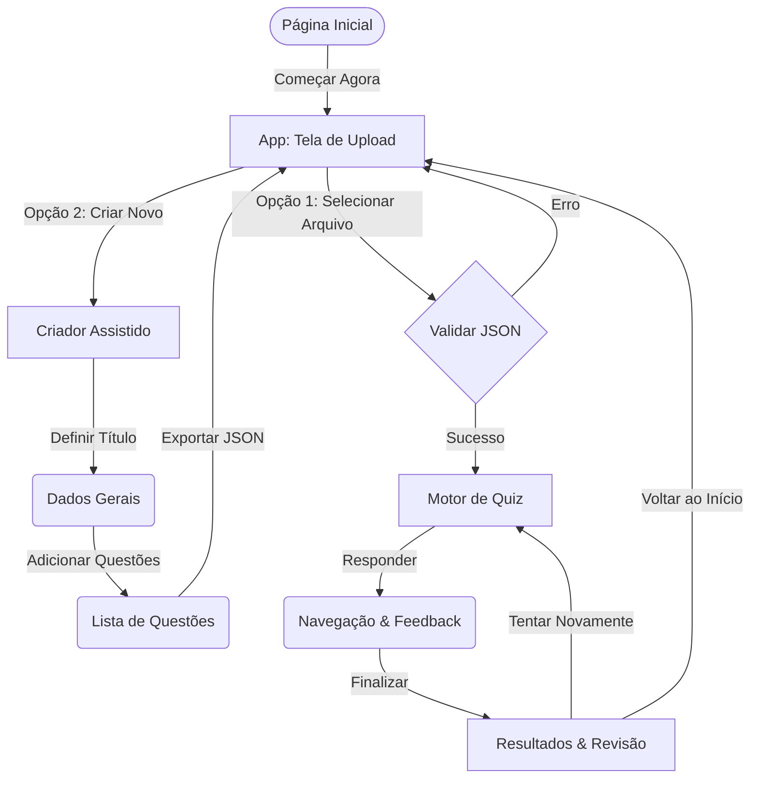
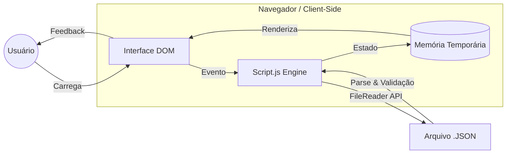
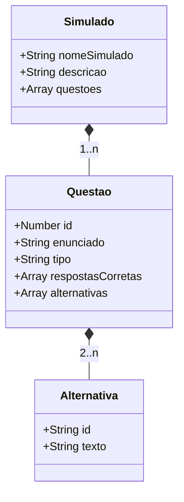

# ⚡ QuizLab

**QuizLab** é uma plataforma de simulados educacionais de alta performance com estética **Cyber Green** e design focado em eficiência. Construído com arquitetura **Client-Side** (100% no navegador), o projeto prioriza o aproveitamento total de tela e a privacidade do usuário, garantindo uma experiência rápida e segura.

[](https://quizlab-chi.vercel.app/)

---

## 📋 Índice

1. [Visão Geral e Fluxo](#-visão-geral-e-fluxo)
2. [Funcionalidades Principais](#-funcionalidades-principais)
3. [Arquitetura Técnica](#-arquitetura-técnica)
4. [Especificação de Dados (JSON)](#-especificação-de-dados-json)
5. [Identidade Visual](#-identidade-visual-cyber-green)
6. [Instalação e Licença](#-instalação-e-licença)

---

## 🔭 Visão Geral e Fluxo

O QuizLab foi desenhado para ser uma ferramenta ágil e intuitiva. O diagrama abaixo ilustra o fluxo de navegação do usuário.



---

## 🚀 Funcionalidades Principais

- **🎨 Design Otimizado**: Interface compacta e retangular, projetada para máxima produtividade, eliminando desperdício de espaço.
- **🛠️ Criador Assistido**: Sistema de etapas (Wizard) com Acordeão para criar e validar simulados de forma organizada.
- **📑 Documentação Integrada**: Central de ajuda completa para usuários e desenvolvedores acessível via `docs.html`.
- **🔘 Interface Intuitiva**: Navegação baseada em ícones e textos claros para um fluxo de uso sem fricção.
- **🔒 Privacidade Absoluta**: Processamento local. Seus dados e simulados nunca saem do seu dispositivo.
- **📱 UX Dinâmica**: Navbar que se oculta automaticamente no desktop e suporte a **Double Tap** no mobile para controle de visibilidade.

---

## 💻 Arquitetura Técnica

O sistema opera de forma reativa e puramente local, utilizando o navegador como motor de processamento.



- **Vanilla CSS**: Sistema de Design Tokens, Glassmorphism e Layouts Grid/Flexbox dinâmicos.
- **Vanilla JavaScript**: Lógica pura sem dependências externas, focada em manipulação eficiente da DOM.
- **SVG System**: Sistema de ícones vetoriais para nitidez absoluta em qualquer resolução.

---

## 📝 Especificação de Dados (JSON)

O QuizLab utiliza um formato JSON estrito para garantir a integridade dos testes:



### Regras de Validação
- **Escolha Única**: Requer exatamente 1 resposta correta.
- **Múltipla Escolha**: Requer pelo menos 2 respostas corretas.

---

## 🎨 Identidade Visual (Cyber Green)

| Token | Valor | Aplicação |
|-------|-------|-----------|
| `--primary-500` | `#c4ff00` | Ações principais e destaques neon |
| `--bg-body` | `#050505` | Fundo profundo e imersivo |
| `--radius-sm` | `2px` | Bordas técnicas e precisas |
| `--success` | `#00ff9d` | Respostas corretas e sucesso |
| `--error` | `#ff0055` | Alertas e respostas incorretas |

---

## 🔧 Instalação e Uso

O projeto é estático e pronto para uso imediato.

1. **Clone o repositório**:
   ```bash
   git clone https://github.com/DessimA/quizlab.git
   ```
2. **Execute**:
   Abra o arquivo `index.html` em qualquer navegador moderno.

---

## 📄 Licença e Créditos

Projeto desenvolvido por **José Anderson da Silva Costa**. Licenciado sob a **MIT License**.

<p align="center">
  <a href="https://www.linkedin.com/in/dessim/" target="_blank"></a>
  <a href="https://github.com/DessimA" target="_blank"></a>
  <a href="https://meus-links-olive.vercel.app/" target="_blank"></a>
</p>