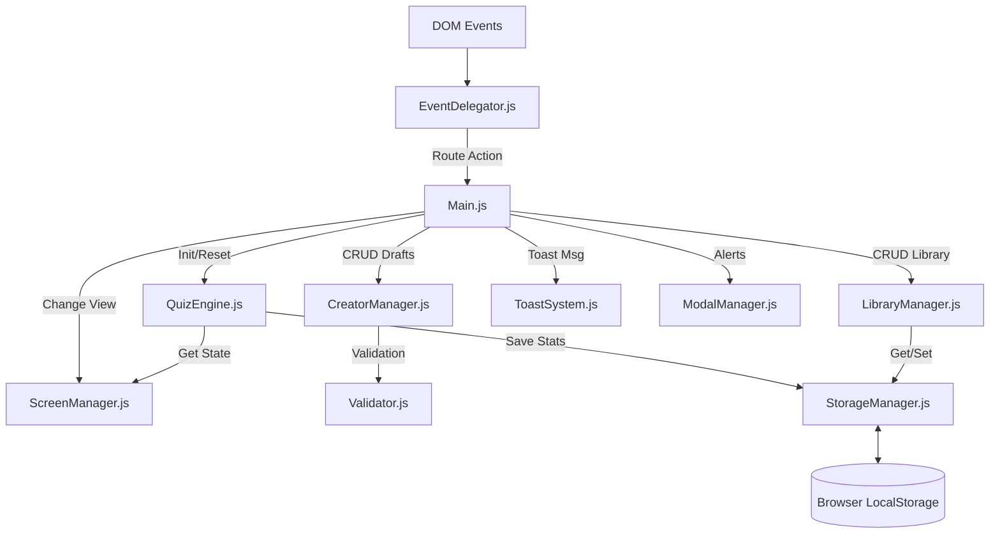

# QuizLab | Documentação Técnica & Arquitetura


> **Autor:** José Anderson ([@DessimA](https://github.com/DessimA))  
> **LinkedIn:** [/in/dessim](https://www.linkedin.com/in/dessim/)  
> **Website:** [meus-links-olive.vercel.app](https://meus-links-olive.vercel.app/)

---

## 📑 Índice

1. [Visão Geral e Filosofia](#-visão-geral-e-filosofia)
2. [Arquitetura de Software](#-arquitetura-de-software)
3. [Gerenciamento de Estado (QuizEngine)](#-gerenciamento-de-estado-quizengine)
4. [Sistema de Eventos (Delegator)](#-sistema-de-eventos-delegator)
5. [Interface e UX (ScreenManager)](#-interface-e-ux-screenmanager)
6. [Persistência de Dados](#-persistência-de-dados)
7. [Protocolo JSON](#-protocolo-json)
8. [Design System](#-design-system)
9. [Contribuição](#-contribuição)

---

## 🔭 Visão Geral e Filosofia

O **QuizLab** é uma Single Page Application (SPA) desenvolvida puramente em **Vanilla JavaScript (ES6+)**. O objetivo técnico é provar que aplicações complexas e reativas podem ser construídas sem o *overhead* de frameworks modernos (React, Vue, Angular), utilizando padrões de projeto clássicos e APIs nativas do navegador.

**Pilares Técnicos:**
*   **Zero Dependencies:** Nenhuma biblioteca externa (npm, builds, bundlers).
*   **Client-Side First:** Toda a lógica e persistência ocorrem no navegador do usuário.
*   **Modularidade:** Código separado por responsabilidade em IIFEs (Immediately Invoked Function Expressions).
*   **DRY (Don't Repeat Yourself):** Reutilização intensiva de lógica de renderização e validação.

---

## 🏗 Arquitetura de Software

O projeto não utiliza classes (POO clássica), mas sim **Objetos Singleton** expostos no escopo global `window`, simulando *namespaces*.

### Diagrama de Comunicação de Módulos



### Estrutura de Pastas e Responsabilidades

*   `js/main.js`: **Entry Point**. Inicializa os componentes e registra o mapa de eventos global.
*   `js/core/`:
    *   `config.js`: Constantes globais (`CONFIG`), Enums de tipos de questão e limites.
    *   `storage-manager.js`: *Facade* para o `localStorage`. Trata serialização JSON e erros.
    *   `validator.js`: Validação de Schema JSON e regras de input do criador.
*   `js/features/`:
    *   `quiz-engine.js`: O "cérebro". Mantém o estado atual (`currentQuestion`, `userAnswers`, `score`).
    *   `creator-manager.js`: Lógica do Wizard de criação, Drag & Drop e exportação.
    *   `library-manager.js`: Renderização da grid de simulados salvos e lógica de busca.
*   `js/ui/`:
    *   `screen-manager.js`: Controla visibilidade de `.container` e atualiza Headers.
    *   `event-delegator.js`: Implementa o padrão **Command**.

---

## ⚙ Gerenciamento de Estado (QuizEngine)

O `QuizEngine` não manipula o DOM. Ele apenas detém a verdade sobre o progresso do usuário.

**Estrutura do State (`_state`):**
```javascript
{
    quizData: Object,        // O JSON carregado
    libraryId: String|null,  // ID se estiver salvo na biblioteca
    currentQuestion: Int,    // Índice atual (0-based)
    userAnswers: Array,      // Array<String|Array> (respostas do user)
    questionAnswered: Array, // Array<Boolean> (flags de confirmação)
    visitedQuestions: Array, // Array<Boolean> (para navegação)
    correctCount: Int,
    incorrectCount: Int
}
```

**Lógica de "Confirmar Resposta":**
1.  Usuário seleciona alternativa -> Atualiza `userAnswers[idx]`.
2.  Usuário clica "Confirmar" -> `QuizEngine.confirm()`:
    *   Trava a questão (`questionAnswered[idx] = true`).
    *   Compara com `quizData.respostasCorretas`.
    *   Incrementa `correctCount` ou `incorrectCount`.
    *   Retorna `true/false` para a UI renderizar o feedback.

---

## 🎮 Sistema de Eventos (Delegator)

Para evitar centenas de `onclick` espalhados, usamos **Event Delegation**. Um único *listener* no `window` captura todos os cliques.

**Como funciona:**
1.  O elemento HTML recebe um atributo `data-action="nome-da-acao"`.
    *   Ex: `<button data-action="next-question">`
2.  `EventDelegator.js` intercepta o clique.
3.  Verifica se o alvo (ou pai) tem `data-action`.
4.  Busca a função correspondente no registro do `main.js` e a executa.

**Vantagens:** Performance superior e código HTML desacoplado da lógica JS.

---

## 🖥 Interface e UX (ScreenManager)

### Painel de Informações (HUD)
O HUD (`#quizInfoBar`) possui dois estados controlados via CSS e JS:

1.  **Expandido (Padrão):** Mostra Título, Badge de Score (Acertos/Erros) e Botão de Visibilidade.
2.  **Oculto (`.hidden-panel`):**
    *   O CSS remove o `background`, `border` e oculta todos os filhos diretos (`display: none`).
    *   **Exceção:** O botão `.toggle-visibility-btn` permanece visível, flutuando à direita, sem bordas, apenas o ícone.
    *   Isso libera espaço vertical para questões longas.

### Fluxo de Revisão e Finalização
Para garantir integridade:
1.  **Botão Finalizar:** Só é injetado no DOM na **última questão** E se ela estiver **respondida**.
2.  **Tela de Revisão (`renderFinalReview`):**
    *   Filtra questões onde `questionAnswered[i] === false`.
    *   Gera cards clicáveis com badge amarela `PENDENTE`.
    *   Ao clicar, invoca `jump-to-question` -> `QuizEngine.goTo(i)` -> `ScreenManager.change('quizScreen')`.

---

## 💾 Persistência de Dados

O sistema utiliza chaves específicas no `localStorage` para evitar conflitos:

| Chave | Conteúdo | Descrição |
|:--- |:--- |:--- |
| `quizlab_library` | `Array<Object>` | Lista de simulados importados/criados. Inclui metadados (score médio). |
| `quizlab_draft` | `Object` | Rascunho automático do Criador (salvo a cada 30s). |
| `quizlab_first_visit` | `Boolean` | Flag para exibir modal de onboarding. |

**Estrutura de Item na Biblioteca:**
```javascript
{
    id: "quiz_1700000000000",
    data: { ...JSON Completo... },
    meta: {
        addedAt: Timestamp,
        timesPlayed: Integer,
        averageScore: Integer (0-100)
    }
}
```

---

## 📜 Protocolo JSON

O sistema valida estritamente arquivos importados. O schema obrigatório é:

```json
{
  "nomeSimulado": "String (Obrigatório)",
  "descricao": "String",
  "tags": ["Array", "de", "Strings"],
  "questoes": [
    {
      "id": "Any (usado internamente)",
      "enunciado": "String (HTML safe)",
      "tipo": "unica | multipla",
      "alternativas": [
        { "id": "a", "texto": "..." },
        { "id": "b", "texto": "..." }
      ],
      "respostasCorretas": ["a"] // Array mesmo se for única
    }
  ]
}
```

---

## 🎨 Design System

Utilizamos variáveis CSS (`:root`) em `styles.css` para consistência e "Glassmorphism".

### Cores Semânticas (Badges & Feedback)
O sistema de cores é crítico para a UX de feedback.

| Variável | Hex | Uso |
|:--- |:--- |:--- |
| `--primary-500` | `#c4ff00` | Ações, Neon, Foco, Seleção. |
| `--success` | `#00ff9d` | Resposta Correta, Badge "Respondida". |
| `--error` | `#ff0055` | Resposta Incorreta. |
| `--pending` | `#ffd700` | (Manual no CSS) Badge "Pendente". |
| `--bg-glass` | `rgba(15,15,15,0.92)` | Fundo de cards e modais. |

### Componentes de UI
*   **IconSystem:** Injeção de SVG via Javascript (`IconSystem.render('name')`) para evitar requisições de imagens externas.
*   **Toast:** Sistema de notificação flutuante não-bloqueante.
*   **Modal:** Sistema de sobreposição para confirmações críticas (ex: sair do quiz sem salvar).

---

## 🤝 Contribuição

Quer ajudar a evoluir o QuizLab? Ficaremos felizes com sua colaboração!

Por favor, leia nosso **[Guia de Contribuição (CONTRIBUTING.md)](CONTRIBUTING.md)** para entender os padrões de arquitetura, convenções de código e o fluxo de Pull Requests.

---

*Documentação gerada com base na versão v1.2.0.*